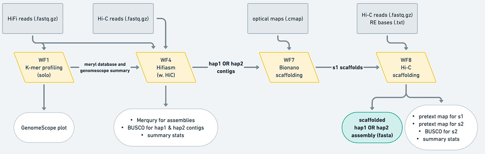
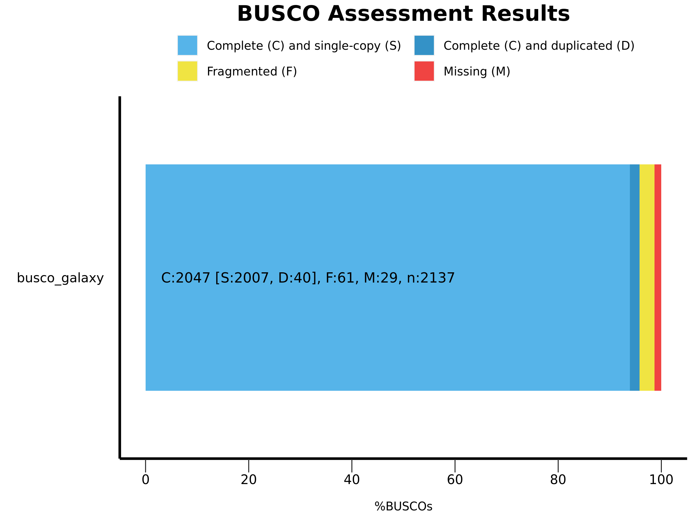
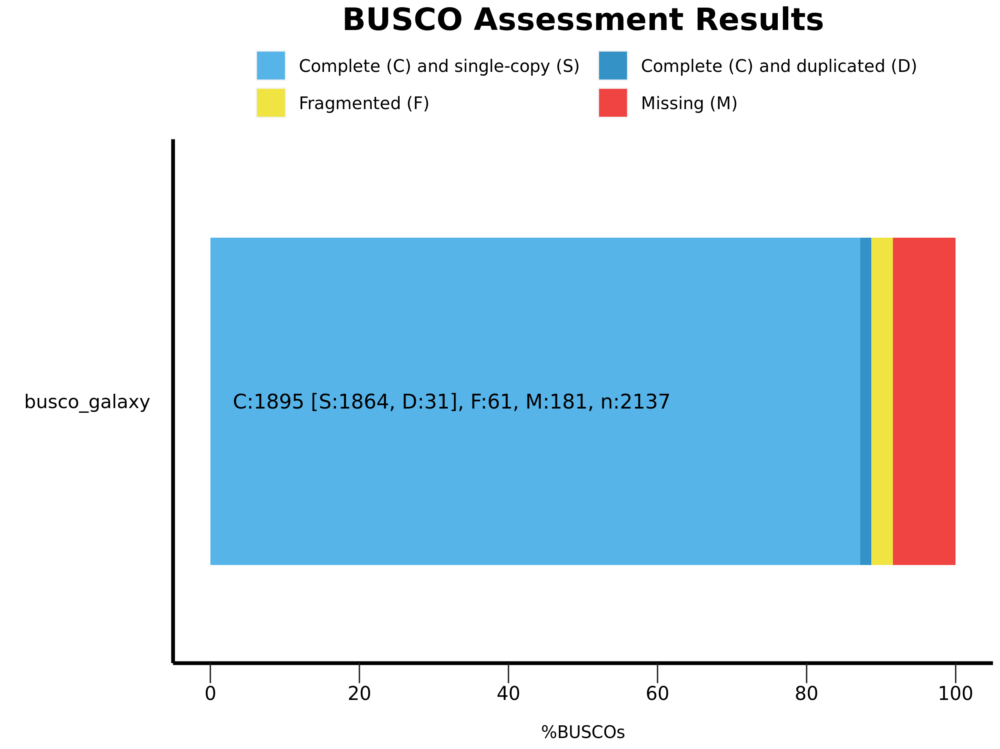
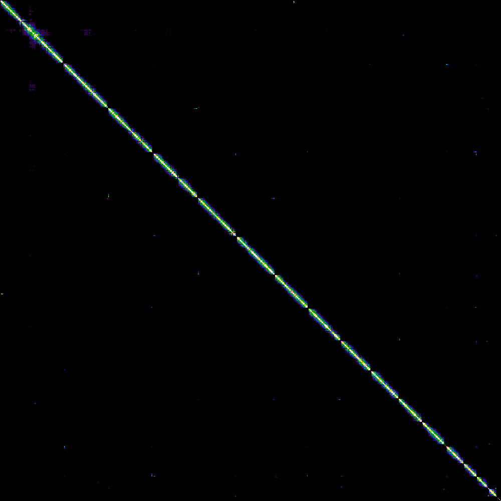
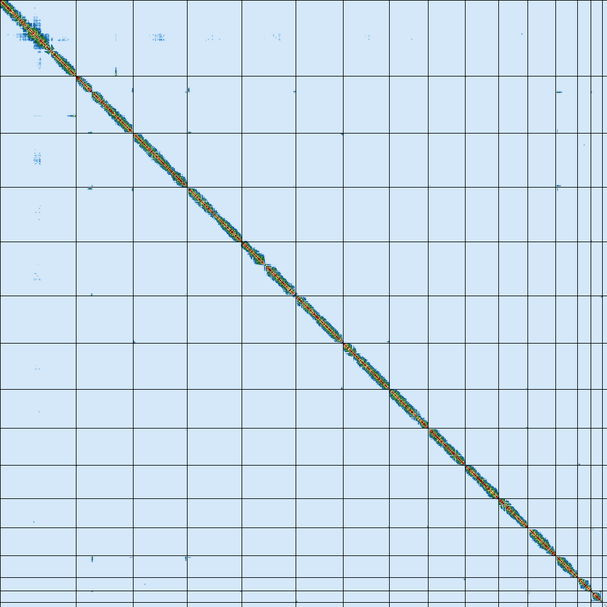

# VGP Genome Assembly, *Saccharomyces cerevisiae*

De novo chromosome-level genome assembly of *Saccharomyces cerevisiae* using 
PacBio HiFi, Bionano optical maps, and Illumina Hi-C data, following the VGP 
pipeline on Galaxy.

---

## Overview

This repository documents a full VGP assembly run on *Saccharomyces cerevisiae* 
S288C (baker's yeast), carried out as part of the Galaxy Training Network tutorial. 
The goal was to produce a haplotype-resolved, chromosome-level genome assembly 
from three data types: PacBio HiFi long reads for initial contig assembly, 
Bionano optical maps for hybrid scaffolding, and Illumina Hi-C reads for 
ordering and orienting scaffolds into chromosomes.

*S. cerevisiae* was chosen as the target organism because its genome is small 
(~11.7 Mb), well-characterised, and has a known chromosome count of 16, making 
it straightforward to validate the final assembly against expectation.

The VGP pipeline follows trajectory D: HiFi + Hi-C + Bionano, which is the 
recommended approach when all three data types are available.

---

## Repository Structure
```
.
├── images/
│   ├── busco/              # BUSCO completeness bar charts for hap1 and hap2
│   ├── contactmaps/
│   │   ├── before_yahs/    # Hi-C contact maps generated from Bionano scaffolds (pre-YaHS)
│   │   └── after_yahs/     # Hi-C contact maps after YaHS scaffolding (final assembly)
│   ├── genomescope/        # GenomeScope2 linear and log k-mer plots
│   └── merqury/            # Merqury spectra-cn and spectra-asm plots for both haplotypes
└── results/
    ├── assembly/           # Final scaffold AGP files from YaHS (scaffolding rounds + final)
    └── stats/              # Assembly statistics: gfastats, BUSCO summaries, GenomeScope2 outputs, Bionano stats
```
## Pipeline


*Official VGP pipeline diagram showing the four workflow stages: k-mer profiling (WF1), 
HiFi + Hi-C assembly with hifiasm (WF4), Bionano scaffolding (WF7), and Hi-C scaffolding (WF8).*
```
HiFi reads (3 FASTA files, PacBio CCS)
        |
    Cutadapt — trims adapter sequences from HiFi reads
        |
    Meryl — counts k-mers (k=21) across all trimmed reads
        |
    GenomeScope2 — estimates genome size (~11.7 Mb), heterozygosity (~0.58%),
                   and ploidy from the k-mer histogram
        |
    hifiasm — assembles HiFi reads into phased contigs using Hi-C data
              to partition haplotypes; produces hap1 and hap2 contig graphs
        |
    gfastats — converts GFA graphs to FASTA and reports assembly stats
               (contig count, N50, total length) for both haplotypes
        |
    BUSCO — assesses gene space completeness against Saccharomycetes
            lineage database (hap1: ~96%, hap2: ~88.7%)
        |
    Merqury — evaluates assembly quality using k-mers from the reads;
              generates spectra-cn and spectra-asm plots to confirm
              phasing and completeness
        |
    Bionano Hybrid Scaffold — integrates optical map data with hap1 contigs
                              to resolve large-scale misassemblies and
                              increase scaffold contiguity (N50: ~923 kb)
        |
    BWA-MEM2 — maps forward and reverse Hi-C reads separately against
               the Bionano-scaffolded assembly
        |
    Filter and merge — filters chimeric Hi-C read pairs using the
                       Arima Genomics protocol (mapq >= 20)
        |
    YaHS — uses Hi-C contact frequency to order and orient scaffolds
           into chromosome-level sequences; produces 16 final scaffolds
           matching the expected chromosome count of S. cerevisiae
        |
    PretextMap + Pretext Snapshot — converts final BAM to a contact map
                                    and exports PNG images for visual
                                    validation of scaffolding quality
```
---

## Species

| | |
|---|---|
| Species | *Saccharomyces cerevisiae* S288C |
| Estimated genome size | ~11.7 Mb |
| Heterozygosity | ~0.58% |
| Ploidy | Diploid |
| Expected chromosomes | 16 |

---

## Data

All input data was obtained from Zenodo as part of the GTN tutorial dataset.

| Dataset | Format | Description |
|---|---|---|
| HiFi reads (3 files) | FASTA | PacBio HiFi long reads |
| Hi-C reads (F + R) | fastqsanger.gz | Illumina Hi-C paired reads |
| Bionano optical maps | .cmap | Bionano restriction enzyme map |

Source: [zenodo.org/record](https://zenodo.org/record/5887339)

---

## Tools

| Tool | Version | Purpose |
|---|---|---|
| Cutadapt | 4.4+galaxy0 | HiFi read trimming |
| Meryl | 1.3+galaxy7 | k-mer counting |
| GenomeScope2 | 2.0+galaxy2 | Genome profiling |
| hifiasm | 0.19.9+galaxy0 | Contig assembly |
| gfastats | - | Assembly statistics |
| BUSCO | 5.5.0+galaxy0 | Gene completeness |
| Merqury | 1.3+galaxy3 | k-mer QC |
| Bionano Hybrid Scaffold | 3.7.0+galaxy3 | Optical map scaffolding |
| BWA-MEM2 | 2.2.1+galaxy1 | Hi-C read mapping |
| Filter and merge | 1.0+galaxy1 | Chimeric read filtering |
| YaHS | 1.2a.2+galaxy1 | Hi-C scaffolding |
| PretextMap | 0.1.9+galaxy0 | Contact map generation |
| Pretext Snapshot | 0.0.3+galaxy1 | Contact map visualization |

---

## Results

| Metric | Value |
|---|---|
| Hap1 contigs | 16 |
| Hap2 contigs | 17 |
| Hap1 BUSCO completeness | ~96% |
| Hap2 BUSCO completeness | ~88.7% |
| Bionano N50 | ~923 kb |
| Final chromosomes after YaHS | 16 |

---

## Genome Profile

GenomeScope2 k-mer analysis on the trimmed HiFi reads. The bimodal distribution 
confirms a diploid genome. The two peaks correspond to heterozygous and homozygous 
k-mer frequencies, with the estimated heterozygosity at ~0.58% — low enough that 
hifiasm can phase the haplotypes reliably without parental data.

| Linear | Log |
|---|---|
|  |  |

---

## BUSCO

Gene completeness evaluated against the Saccharomycetes lineage database. 
Hap1 at ~96% is a strong result for a tutorial-scale run. The lower hap2 
value (~88.7%) is expected since hifiasm without parental data tends to 
produce a more complete hap1 and a less complete hap2.

| Hap1 | Hap2 |
|---|---|
|  |  |

---

## Hi-C Contact Maps

Contact maps generated by PretextMap and visualised with Pretext Snapshot, 
before and after YaHS scaffolding. In the before map, signals are scattered 
across many small Bionano scaffolds. After YaHS, the contacts collapse onto 
a clean diagonal with 16 clearly separated blocks, each corresponding to one 
chromosome of *S. cerevisiae*. This confirms the assembly reached chromosome 
level as expected.

| Before YaHS | After YaHS |
|---|---|
|  |  |

---

## Notes

- This is a tutorial run using publicly available yeast data, not original sequencing
- Only hap1 was taken through Bionano and Hi-C scaffolding; hap2 scaffolding would follow the same steps
- The gfastats version shown is approximate; confirm from your Galaxy history if needed

--- 

## Platform

All steps were run on Galaxy (usegalaxy.org).

## Citations

- Cheng et al. (2021) Haplotype-resolved de novo assembly using phased assembly graphs with hifiasm. *Nature Methods*. https://doi.org/10.1038/s41592-020-01056-5
- Ranallo-Benavidez et al. (2020) GenomeScope 2.0 and Smudgeplots for reference-free profiling of polyploid genomes. *Nature Communications*. https://doi.org/10.1038/s41467-020-14998-3
- Rhie et al. (2020) Merqury: reference-free quality, completeness and phasing assessment for genome assemblies. *Genome Biology*. https://doi.org/10.1186/s13059-020-02134-9
- Simao et al. (2015) BUSCO: assessing genome assembly and annotation completeness with single-copy orthologs. *Bioinformatics*. https://doi.org/10.1093/bioinformatics/btv351
- Zhou et al. (2023) YaHS: yet another Hi-C scaffolding tool. *Bioinformatics*. https://doi.org/10.1093/bioinformatics/btac808
- Rhie et al. (2021) Towards complete and error-free genome assemblies of all vertebrate species. *Nature*. https://doi.org/10.1038/s41586-021-03451-0

---

## Reference

GTN VGP Tutorial: [Vertebrate genome assembly using HiFi, Bionano and Hi-C data](https://training.galaxyproject.org/training-material/topics/assembly/tutorials/vgp_genome_assembly/tutorial.html)
